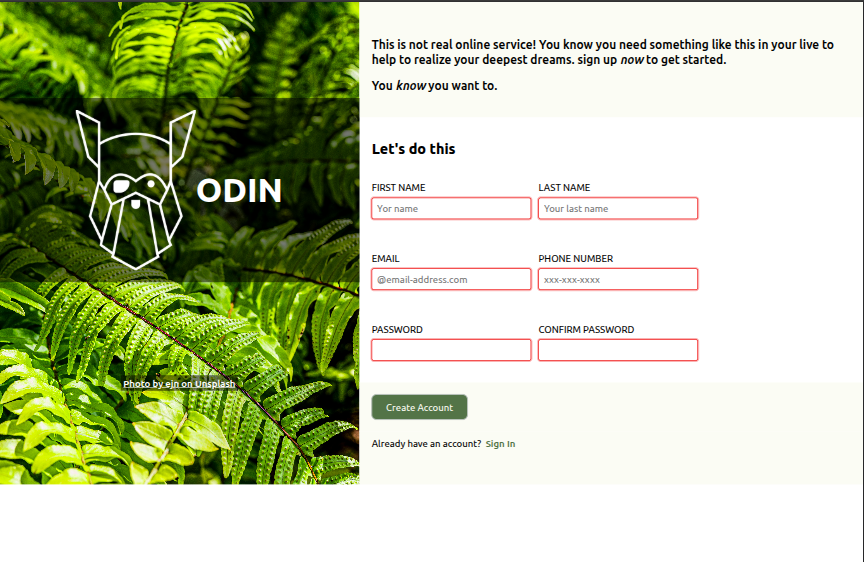

# Sign-up Form

This project is a sign-up form page, created as part of [The Odin Project's](https://www.theodinsprogram.com/) curriculum. The main goal is to practice building forms with HTML5 and styling them with modern CSS, including providing feedback for form validation.

## ✨ Features

- A clean, two-column layout using CSS Flexbox.
- Custom-styled form inputs.
- Client-side form validation using HTML5 attributes (`required`, `minlength`, etc.).
- Visual feedback for input fields based on their validation state (`:valid`, `:invalid`) and focus (`:focus`).

## 📸 Screenshot




## 🚀 Live Demo

You can see a live version of the project here: Live Demo Link

[DEMO LINK](https://giovannihurtado.github.io/odin-sign-up-form/)

## 🛠️ Technologies Used

- **HTML5:** For the structure and semantics of the form.
- **CSS3:** For styling, layout (Flexbox), and custom properties.
- **Google Fonts:** For the "Ubuntu" font.

## 🔧 How to Use

1.  Clone the repository:
    ```bash
    git clone https://github.com/giovannihurtado/odin-sign-up-form.git
    ```
2.  Navigate to the project directory:
    ```bash
    cd sign-up-form
    ```
3.  Open the `index.html` file in your web browser.

## 🙏 Credits

- Project idea and guidelines from The Odin Project.
- Background image by Emils Nemse on Unsplash.
- Logo from The Odin Project assets.